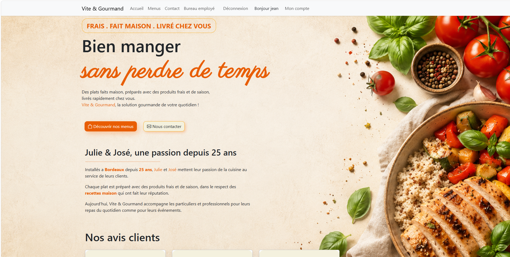
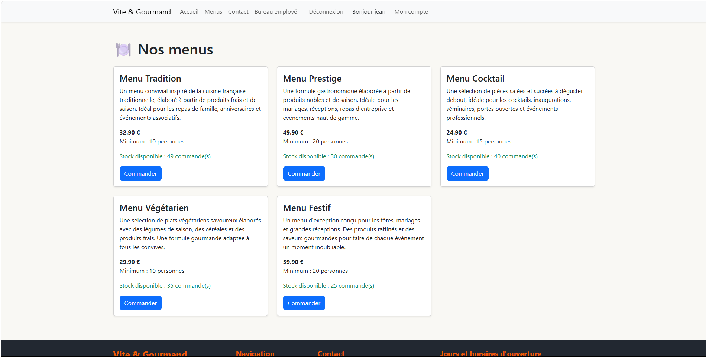
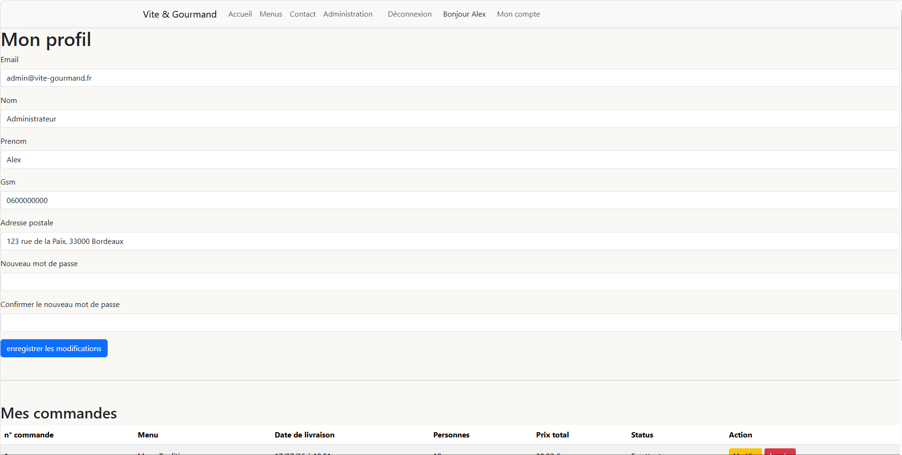
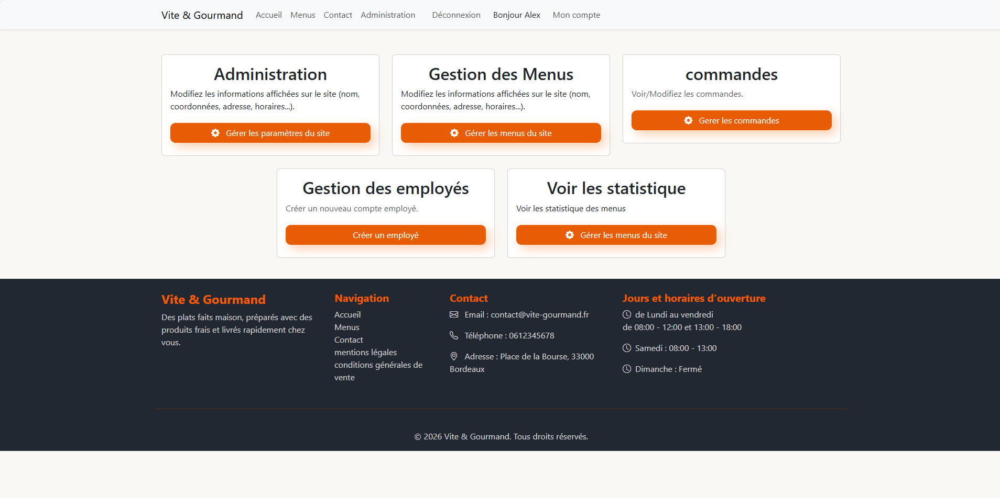
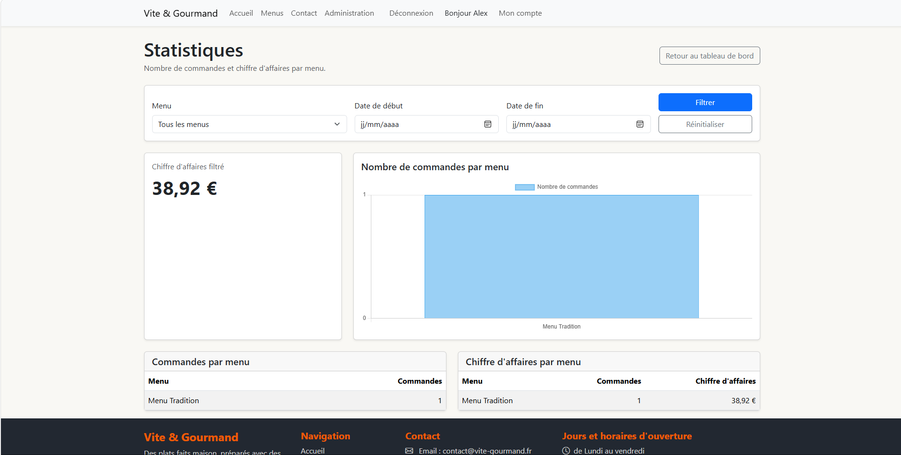
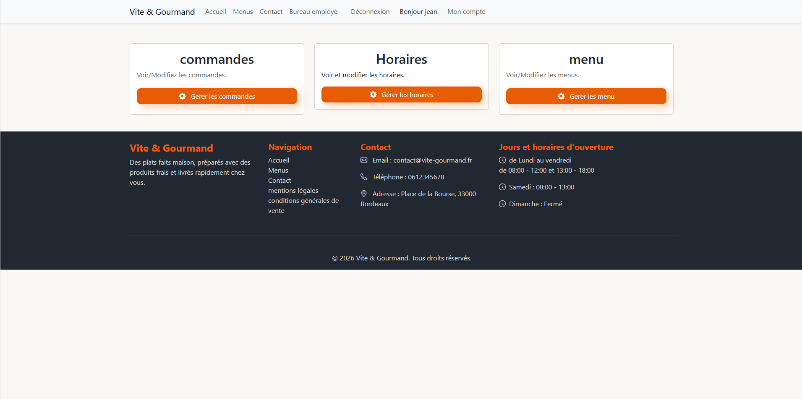

# 🍽️ Vite & Gourmand

Projet réalisé dans le cadre de l'ECF du Titre Professionnel **Développeur Web et Web Mobile**.

Vite & Gourmand est une application web de restauration permettant aux particuliers et aux professionnels 
de commander des menus préparés à partir de produits frais et livrés à domicile.

---

# 📸 Captures d'écran

# 📸 Captures d’écran

## Accueil



## Catalogue des menus



## Profil administrateur



## Tableau de bord administrateur



## Statistiques MongoDB



## Tableau de bord employé




# 🚀 Fonctionnalités

## Front Office

- Consultation des menus
- Création d'un compte
- Connexion utilisateur
- Gestion du profil
- Commande de menus
- Calcul automatique des frais de livraison
- Historique des commandes
- Modification et annulation des commandes (tant qu'elles sont en attente)
- Avis clients
- Formulaire de contact

---

## Espace Employé

- Tableau de bord
- Gestion des commandes
- Validation des commandes
- Refus des commandes
- Finalisation des commandes
- Historique des changements de statut
- Gestion des horaires

---

## Administration

- Gestion des menus
- Gestion des plats
- Gestion des thèmes
- Gestion des allergènes
- Gestion des employés
- Désactivation des comptes employés
- Paramètres du site
- Tableau de bord statistiques
- Chiffre d'affaires
- Nombre de commandes par menu
- Filtres par période
- Filtres par menu

---

# 📊 Statistiques MongoDB

Les statistiques sont enregistrées dans MongoDB.

Les données permettent notamment :

- Nombre de commandes par menu
- Chiffre d'affaires
- Filtrage par période
- Filtrage par menu
- Graphiques Chart.js

---

# 🛠️ Technologies utilisées

## Backend

- PHP 8.3
- Symfony 7
- Doctrine ORM
- Twig

## Frontend

- Bootstrap 5
- JavaScript
- Chart.js

## Bases de données

- MySQL 8
- MongoDB 7

## Infrastructure

- Docker
- Docker Compose
- Nginx
- VPS OVHcloud
- Debian 12

---

# 📂 Architecture

```
Symfony
│
├── Controller
├── Entity
├── Repository
├── Service
├── Form
├── Twig
└── Docker
```

---

# 🐳 Installation

## Cloner le dépôt

```bash
git clone https://github.com/Shade50/ecf---Vite-Gourmand.git
```

Entrer dans le projet

```bash
cd vite-gourmand
```

Construire les conteneurs

```bash
docker compose up -d --build
```

Lancer les migrations

```bash
php bin/console doctrine:migrations:migrate
```

---

# 👤 Comptes de démonstration

## Administrateur

```
Email :
admin@vite-gourmand.fr

Mot de passe :
**********
```

## Employé

```
Email :
employee@vite-gourmand.fr

Mot de passe :
********
```

---

# 📦 Déploiement

L'application est déployée sur :

- VPS OVHcloud
- Debian 12
- Docker
- Docker Compose
- Nginx
- MySQL
- MongoDB

---


---

# 👨‍💻 Auteur

Projet réalisé par **Jérôme Labbé**

Dans le cadre du passage du Titre Professionnel

**Développeur Web et Web Mobile**

2026